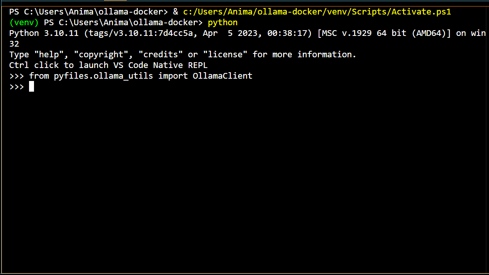

 [](https://codecov.io/gh/anima-kit/ollama-docker)

#     Ollama Docker with Python


<p align="center">
  
</p>

## 🔖 About This Project 

> TL;DR
Learn how to chat with LMs on your local machine. Then, you can use this setup as a base to [power][tutorials] locally run AI agents 🤖.

This repo demonstrates how to set up an [Ollama][ollama] server in [Docker][docker] and use this server in a [Python][python] environment for chatting with LMs on your local machine. It serves as part of the foundation for building AI agents by powering their decision making and response generating processes. 

This project is part of my broader goal to create tutorials and resources for building agents with [LangChain][langchain] and [LangGraph][langgraph]. For more details about how to use this repo and other easily digestible modules to build agents, [check it out here][animakit].

Now, let's get building!

## 🏁 Getting Started 

1.  Make sure [Docker][docker] is installed and running.

1.  Clone the repo, head there, then create a Python environment:

    ```bash
    git clone https://github.com/anima-kit/ollama-docker.git
    cd ollama-docker
    python -m venv venv
    ``` 

    <a id="gs-activate"></a>

1.  Activate the Python environment:

    ```bash
    venv/Scripts/activate
    ```

1. Install the necessary Python libraries:

    ```bash
    pip install -r requirements.txt
    ```

    <a id="gs-start"></a>

4.  Choose to build the Docker containers for GPU or CPU support:

    <details>
    <summary>GPU</summary>

    ```bash
    docker compose -f docker-compose-gpu.yml up -d
    ```
    </details>

    <details>
    <summary>CPU</summary>

    ```bash
    docker compose -f docker-compose-cpu.yml up -d
    ```
    </details>

    After successfully completing this step, the Ollama server will be running on [http://localhost:11434][ollama-url].

1.  Run the test script to ensure the default LM ([Qwen3 0.6B][qwen3:0.6b]) can be invoked:

    ```bash
    python -m scripts.ollama_test
    ```

    From the Docker setup, all Ollama data (including models) will be located in the local folder `./ollama_data/`. All logs will be stored in the `./ollama-docker.log` file.

    <a id="gs-stop"></a>

1.  When you're done, stop the Docker containers and cleanup with:
    <details>
    <summary>GPU</summary>

    ```bash
    docker compose -f docker-compose-gpu.yml down
    ```
    </details>

    <details>
    <summary>CPU</summary>

    ```bash
    docker compose -f docker-compose-cpu.yml down
    ```
    </details>

## 📝 Example Use Cases 

Once set up, you can use this foundation to chat with different LMs. Check out the [Ollama library][ollama-library] for a list of available models.

The main class to interact with an LM is the OllamaClient class which is built on the [Ollama Python library][ollama-python]. The `get_response` method of this class can be used to get an LM response for a given LM and user message. 

For example, to chat with an LM through a custom script, follow these steps:

1.  Do [step 3][step-activate] and [step 5][step-start] of the `🏁 Getting Started` section to activate the Python environment and run the Ollama server.

1.  Create a script named `my-lm-chat-ex.py` with the following:

    ```python
    ## Import OllamaClient class
    from pyfiles.ollama_utils import OllamaClient

    ## Initialize client
    client = OllamaClient()

    ## Define LM to use and message to send
    # Change these variables to use a different LM or send a different message
    lm_name = 'qwen3:0.6b'
    message = 'What is the average temperature of the universe?'

    ## Get response
    client.get_response(lm_name=lm_name, message=message)
    ```

3. Run the script

    ```bash
    python my-lm-chat-ex.py
    ```

4. When you're done, do [step 7][step-stop] of the `🏁 Getting Started` section to stop the Docker container and cleanup.

For a more detailed discussion of what can be done with this repo, [check out the companion tutorial here][ollama-tutorial].

## 📚 Next Steps & Learning Resources 

This project is part of a series on building AI agents. For a deeper dive, [check out my tutorials][tutorials]. Topics include:

- Setting up local servers (like this one) to power the agent
- Example agent workflows (simple chatbots to specialized agents)
- Implementing complex RAG techniques
- Discussing various aspects of AI beyond agents

Want to learn how to expand this setup? [Visit my portfolio][animakit] to explore more tutorials and projects!

## 🏯 Project Structure

```
├── docker-compose-cpu.yml  # Docker settings for CPU build of Ollama container
├── docker-compose-gpu.yml  # Docker settings for GPU build of Ollama container
├── pyfiles/                # Python source code
│   └── ollama_utils.py     # Python methods to use Ollama server
│   └── logger.py           # Python logger for tracking progress
├── requirements.txt        # Required Python libraries for main app
├── requirements-dev.txt    # Required Python libraries for development
├── scripts/                # Example scripts to use Python methods
├── tests/                  # Testing suite
```

## ⚙️ Tech 

- [Docker][docker]: For setup of local Ollama server
- [Ollama][ollama]: Local LM server setup and run in Docker
- [Ollama Python library][ollama-python]: Interacting with the Ollama server via a local Python environment

## 🔗 Contributing 

This repo is a work in progress. If you'd like to suggest or add improvements, fix bugs or typos etc., feel free to contribute. Check out the [contributing guidelines][contributing] to get started.


[animakit]: http://anima-kit.github.io/
[contributing]: CONTRIBUTING.md
[docker]: https://www.docker.com/
[langchain]: https://www.langchain.com/
[langgraph]: https://www.langchain.com/langgraph/
[ollama]: https://ollama.com/
[ollama-library]: https://ollama.com/library/
[ollama-python]: https://github.com/ollama/ollama-python/
[ollama-tutorial]: http://anima-kit.github.io/tutorials/servers/ollama/
[ollama-url]: http://localhost:11434/
[python]: https://www.python.org/
[qwen3:0.6b]: https://ollama.com/library/qwen3:0.6b
[step-activate]: https://github.com/anima-kit/ollama-docker/blob/main/README.md#gs-activate
[step-start]: https://github.com/anima-kit/ollama-docker/blob/main/README.md#gs-start
[step-stop]: https://github.com/anima-kit/ollama-docker/blob/main/README.md#gs-stop
[tutorials]: https://anima-kit.github.io/tutorials/